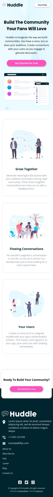

# Frontend Mentor - Huddle landing page with alternating feature blocks solution

This is a solution to the [Huddle landing page with alternating feature blocks challenge on Frontend Mentor](https://www.frontendmentor.io/challenges/huddle-landing-page-with-alternating-feature-blocks-5ca5f5981e82137ec91a5100). Frontend Mentor challenges help you improve your coding skills by building realistic projects.

### The challenge

Users should be able to:

-   View the optimal layout for the site depending on their device's screen size
-   See hover states for all interactive elements on the page

### Screenshot

-   Desktop Version


-   Mobile Version



### Links

-   [Live site URL here](https://your-live-site-url.com)

### Built with

-   Semantic HTML5 markup
-   CSS custom properties
-   Flexbox
-   CSS Grid
-   Mobile-first workflow

### What I learned

-   Link multiple stylesheet with media query

```html
<link rel="stylesheet" href="./css/mobile.css" /> <link rel="stylesheet" media="(min-width:800px)"
"href="./css/desktop.css"/>
```

## Author

-   Facebook - [Ta Thanh Dat](https://www.facebook.com/tathanh.dat.5/)
-   Frontend Mentor - [@Ta Thanh Dat](https://www.frontendmentor.io/profile/tathanhdat)
